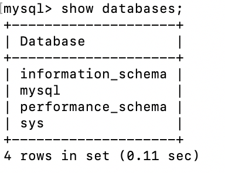

# MySQL数据库 – 核心知识

## 为什么需要数据库？

​	◼ **任何的软件系统都需要存放大量的数据，这些数据通常是非常复杂和庞大的：**

 比如用户信息包括姓名、年龄、性别、地址、身份证号、出生日期等等；

 比如商品信息包括商品的名称、描述、价格（原价）、分类标签、商品图片等等；

 比如歌曲信息包括歌曲的名称、歌手、专辑、歌曲时长、歌词信息、封面图片等等；

◼ **那么这些信息不能直接存储到文件中吗？可以，但是文件系统有很多的缺点：**

 很难以合适的方式组织数据（多张表之前的关系合理组织）；

 并且对数据进行增删改查中的复杂操作（虽然一些简单确实可以），并且保证单操作的原子性；

 很难进行数据共享，比如一个数据库需要为多个程序服务，如何进行很好的数据共享；

 需要考虑如何进行数据的高效备份、迁移、恢复；

 等等

◼ 数据库通俗来讲就是一个存储数据的仓库，数据库本质上就是一个软件、一个程序

## 常见的数据库有哪些？

◼ **通常我们将数据划分成两类：****关系型数据库****和****非关系型数据库****；** 

◼ **关系型数据库：MySQL、Oracle、DB2、SQL Server、Postgre SQL等；**

 关系型数据库通常我们会创建很多个二维数据表；

 数据表之间相互关联起来，形成一对一、一对多、多对多等关系；

 之后可以利用SQL语句在多张表中查询我们所需的数据；

◼ **非关系型数据库：MongoDB、Redis、Memcached、HBse等；**

 非关系型数据库的英文其实是Not only SQL，也简称为NoSQL； 

 相当而言非关系型数据库比较简单一些，存储数据也会更加自由（甚至我们可以直接将一个复杂的json对象直接塞入到数据

库中）；

 NoSQL是基于Key-Value的对应关系，并且查询的过程中不需要经过SQL解析； 

◼ **如何在开发中选择他们呢？具体的选择会根据不同的项目进行综合的分析，我这里给一点点建议：**

 目前在公司进行后端开发（Node、Java、Go等），还是以关系型数据库为主；

 比较常用的用到非关系型数据库的，在爬取大量的数据进行存储时，会比较常见；

## 认识MySQL

◼ **我们的课程是开发自己的后端项目，所以我们以关系型数据库MySQL作为主要内容。**

◼ **MySQL的介绍：**

 MySQL原本是一个开源的数据库，原开发者为瑞典的MySQL AB公司；

 在2008年被Sun公司收购；在2009年，Sun被Oracle收购；

 所以目前MySQL归属于Oracle； 

◼ **MySQL是一个关系型数据库，其实本质上就是一款软件、一个程序：**

 这个程序中管理着多个数据库；

 每个数据库中可以有多张表；

 每个表中可以有多条数据；

## 下载MySQL软件

◼ **下载地址：****https://dev.mysql.com/downloads/mysql/**

◼ **根据自己的操作系统下载即可；**

◼ **推荐大家直接下载安装版本，在安装过程中会配置一些环境变量；**

 Windows推荐下载MSI的版本；

 Mac推荐下载DMG的版本；

◼ **这里我安装的是MySQL最新的版本：8.0.31（不再使用旧的MySQL5.x的版本）**

## GUI工具的介绍

**我们会发现在终端操作数据库有很多不方便的地方：**

 语句写出来没有高亮，并且不会有任何的提示；

 复杂的语句分成多行，格式看起来并不美观，很容易出现错误；

 终端中查看所有的数据库或者表非常的不直观和不方便；

 等等...

◼ **所以在开发中，我们可以借助于一些GUI工具来帮助我们连接上数据库，之后直接在GUI工具中操作就会非常方便。**

◼ **常见的MySQL的GUI工具有很多，这里推荐几款：**

 Navicat：个人最喜欢的一款工作，但是是收费的（有免费的试用时间）；

 SQLYog：一款免费的SQL工具；

 TablePlus：常用功能都可以使用，但是会多一些限制（比如只能开两个标签页）；

## 认识SQL语句

◼ **我们希望操作数据库（特别是在程序中），就需要有和数据库沟通的语言，这个语言就是SQL：** 

 SQL是Structured Query Language，称之为结构化查询语言，简称SQL； 

 使用SQL编写出来的语句，就称之为SQL语句； 

 SQL语句可以用于对数据库进行操作； 

◼ **事实上，常见的关系型数据库SQL语句都是比较相似的，所以你学会了MySQL中的SQL语句，之后去操作比如Oracle或者其他**

**关系型数据库，也是非常方便的。**

◼ **SQL语句的常用规范：**

 通常关键字使用大写的，比如CREATE、TABLE、SHOW等等；

 一条语句结束后，需要以 ; 结尾；

 如果遇到关键字作为表明或者字段名称，可以使用``包裹;

## SQL语句的分类

◼ **常见的SQL语句我们可以分成四类：**

◼ DDL（Data Definition Language）：数据定义语言；

 可以通过DDL语句对数据库或者表进行：创建、删除、修改等操作；

◼ DML（Data Manipulation Language）：数据操作语言；

 可以通过DML语句对表进行：添加、删除、修改等操作；

◼ DQL（Data Query Language）：数据查询语言；

 可以通过DQL从数据库中查询记录；（重点）

◼ DCL（Data Control Language）：数据控制语言；

 对数据库、表格的权限进行相关访问控制操作；

◼ 接下来我们对他们进行一个个的学习和掌握。

## MySQL的连接操作

### 启动MySql

> mysql -uroot -p 启动mysql
>
> show global variables like 'port' // 查看port

### 查看数据库

```
shwo databases;
```

**MySQL默认的数据库：**

>  infomation_schema：**信息数据库，其中包括MySQL在维护的其他数据库、表、列、访问**
>
> **权限等信息；**
>
>  performance_schema：**性能数据库，记录着MySQL Server数据库引擎在运行过程中的一**
>
> **些资源消耗相关的信息；**
>
>  mysql：**用于存储数据库管理者的用户信息、权限信息以及一些日志信息等；**
>
>  sys：**相当于是一个简易版的performance_schema，将性能数据库中的数据汇总成更容易**
>
> **理解的形式；**



### 创建数据库

````
// 如果创建的数据库不存在则创建，反之报错
create database coderhub;
// 如果创建的数据库不存在则创建，反之不创建
CREATE DATABASE IF NOT EXISTS bilibili;
// 需要使用的编码
CREATE DATABASE IF NOT EXISTS bilibili
DEFAULT CHARACTER SET utf8mb4 COLLATE utf8mb4_0900_ai_ci;
````

### 删除数据库

```
// 如果存在则删除，反之报错
DROP DATABASE 数据库名
// 如果存在则删除，反之不执行删除操作
DROP DATABASE IF EXIT 数据库名

```

### 查看当前数据库

````
SELECT DATABASE();
````

## 数据表的操作

### use数据库

````
use coderhub;
````

### 修改数据库的字符集和排序规则

````
ALTER DATABASE bilibili CHARACTER SET = utf8 COLLATE = utf8_unicode_ci;
````

### 创建表

````sql
crte table user(
	name varchar(20),
	age int,
	height double
);

// 推荐使用下面这种 不会报错
CREATE TABLE IF NOT EXISTS `users`(
  name VARCHAR(20),
  age INT,
  height DOUBLE
);

````

### 查看表

````
show tables;
````

###  查看某一个表结构

````
DESC user;
````

### 查看创建时的表结构

```
SHOW CREATE TABLE `products`;
```

### 查看数据

````
select * from 表名;  *代表所有字段;
````

## DDL（Data Definition Language）：数据定义语言

> 对数据库和表结构进行操作

### 表约束

>◼ **主键：PRIMARY KEY**
>
> **一张表中，我们为了区分****每一条记录的唯一性****，必须****有一个字段是永远不会重复****，并且****不会为****空的，这个字段我们通常会将它设**
>
>**置为****主键****：** 
>
> 主键是表中唯一的索引； 
>
> 并且必须是NOT NULL的，如果没有设置 NOT NULL，那么MySQL也会隐式的设置为NOT NULL； 
>
> 主键也可以是多列索引，PRIMARY KEY(*key_part, ...)**，我们一般称之为**联合主键**；* 
>
> 建议：开发中主键字段应该是和业务无关的，尽量不要使用业务字段来作为主键；
>
>◼ **唯一：UNIQUE**
>
> 某些字段在开发中我们希望是唯一的，不会重复的，比如手机号码、身份证号码等，这个字段我们可以使用UNIQUE来约束：
>
> 使用UNIQUE约束的字段在表中必须是不同的；
>
> UNIQUE 索引允许NULL包含的列具有多个值NULL；
>
>◼ **不能为空：NOT NULL**
>
> 某些字段我们要求用户必须插入值，不可以为空，这个时候我们可以使用 NOT NULL 来约束；
>
>◼ **默认值：DEFAULT**
>
> 某些字段我们希望在没有设置值时给予一个默认值，这个时候我们可以使用 DEFAULT来完成；
>
>◼ **自动递增：AUTO_INCREMENT**
>
> 某些字段我们希望不设置值时可以进行递增，比如用户的id，这个时候可以使用AUTO_INCREMENT来完成；
>
>◼ **外键约束也是最常用的一种约束手段，我们再讲到多表关系时，再进行讲解；**


### 修改表

#### update表名

```
ALTER TABLE `表名` RENAME TO `表名`;
```

#### 表添加字段

````
ALTER TABLE `表名` ADD 字段名 字段类型（如：INT）;
如： ALTER TABLE `t_users` ADD createTime TIMESTAMP;
````

#### 修改表的字段名

````
ALTER TABLE `表名` CHANGE 修改字段名 修改后字段名 字段类型;
````

#### 删除表中的字段

```
ALTER TABLE `表名` DROP 字段名;
```

#### 修改字段的类型

````
ALTER TABLE `表名` MODIFY 字段名 类型
````

## DML（Data Manipulation Language）：数据操作语言；

### 插入数据

````sql
// 插入数据

INSERT INTO 表名 (对应名的字段名...) VALUES (字段的value值)

insert into user (name, age, height) values ('why', 18, 1.88);
insert into user (name, age, height) values ('kobe', 40, 1.98);
````

### 删除数据

````sql
DELETE FROM '表名' // 删除所有数据（不是非常必要千万不要执行此操作）;

// 条件删除数据
DELETE FROM `表名` WHERE 条件;
例子：DELETE FROM `products` WHERE id = 3;
````

### 修改数据

````sql
// 修改表中的所有数据
UPDATE `表名` SET `修改的字段名 (key=value)`; // 不同字段之间需要逗号分隔
例子: UPDATE `PRODUCTS` SET price = 888;

// 根据条件修改数据
UPDATE `表名` SET `字段名(key=value)` WHERE 条件;
例子: UPDATE `products` SET price = 8888 WHERE id = 4;
			UPDATE `products` SET price = 8888, title = '小米至尊版' WHERE id = 4;
````

### 修改数据扩展

````sql
ALTER TABLE `PRODUCTS(表名)` ADD `updateTime(字段名)` TIMESTAMP DEFAULT CURRENT_TIMESTAMP ON UPDATE CURRENT_TIMESIAMP;

TIMESTAMP DEFAULT CURRENT_TIMESTAMP  设置成当前的默认时间
ON UPDATE CURRENT_TIMESIAMP  修改时对应字段自动去当前时间
````

## DQL（Data Query Language）：数据查询语言；

> 可以通过DQL从数据库中查询记录；（重点）
>
> SELECT用于从一个或者多个表中检索选中的行（Record）

````sqlite
SELECT select_expr [, select_expr]...
    [FROM table_references]
    [WHERE where_condition]
    [ORDER BY expr [ASC | DESC]]
    [LIMIT {[offset,] row_count | row_count OFFSET offset}]
    [GROUP BY expr]
    [HAVING where_condition]
    
    
CREATE TABLE IN NOT EXISTS `t_songs`( id INT PRIMARY KEY AUTO_INCREMENT, name VARCHAR(20) NOT NULL, duration INT DEFAULT 0, singer VARCHAR(10) );
````

### 查询数据

``` sql
# 查询所有数据
SELECT * FROM 表名;

# 查询特定字段（注意多个字段需要用逗号分隔）
SELECT 字段,字段 FROM 表名
例子：SELECT title, brand, price FROM `products`;

# 查询字段时取别名
SELECT 字段 AS 别名 FROM 表名
SELECT 字段 别名 FROM 表名 // AS 可以省略，字段与别名之间使用空格分隔
例子：SELECT title as t, brand as b, price p FROM `products`;
```

### WHERE 查询条件

#### 语法

> SELECT 字段列表 FROM 表名 WHERE 条件列表;

#### 比较运算符

| 比较运算符      | 功能                                       |
| :-------------- | :----------------------------------------- |
| >               | 大于                                       |
| >=              | 大于等于                                   |
| <               | 小于                                       |
| <=              | 小于等于                                   |
| =               | 等于                                       |
| <> 或 !=        | 不等于                                     |
| BETWEEN … AND … | 在某个范围内（含最小、最大值）             |
| IN(…)           | 在in之后的列表中的值，多选一               |
| LIKE 占位符     | 模糊匹配（_匹配单个字符，%匹配任意个字符） |
| IS NULL         | 是NULL                                     |

##### WHERE的比较运算符

````sql
# 查询价格小于1000的手机
SELECT * FROM `products` WHERE price < 1000;
# 查询价格大于等于2000的手机
SELECT * FROM `products` WHERE price >= 2000;
# 价格等于3399的手机
SELECT * FROM `products` WHERE price = 3399;
# 价格不等于3399的手机
SELECT * FROM `products` WHERE price != 3399;
# 查询华为品牌的手机
SELECT * FROM `products` WHERE `brand` = '华为';
# 查询范围
SELECT * FROM PRODUCTS WHERE PRICE BETWEEN 700 AND 1000;
````

#### 逻辑运算符

| 逻辑运算符 | 功能                         |
| :--------- | :--------------------------- |
| AND 或 &&  | 并且（多个条件同时成立）     |
| OR 或 \|\| | 或者（多个条件任意一个成立） |
| NOT 或 !   | 非，不是                     |

##### WHERE的逻辑运算符

````SQL
# 查询品牌是华为，并且小于2000元的手机
SELECT * FROM `products` WHERE `brand` = '华为' and `price` < 2000;
SELECT * FROM `products` WHERE `brand` = '华为' && `price` < 2000;
# 查询1000到2000的手机（不包含1000和2000）
SELECT * FROM `products` WHERE price > 1000 and price < 2000;
# OR: 符合一个条件即可
# 查询所有的华为手机或者价格小于1000的手机
SELECT * FROM `products` WHERE brand = '华为' or price < 1000;
# 查询1000到2000的手机（包含1000和2000）
SELECT * FROM `products` WHERE price BETWEEN 1000 and 2000;
# 查看多个结果中的一个
SELECT * FROM `products` WHERE brand in ('华为', '小米'); // 注意： in 是包含的意思 只查询括号中的条件，而不是一个范围
````

#### 模糊查询

**模糊查询使用LIKE关键字，结合两个特殊的符号：**

>**%表示匹配任意个的任意字符;**
>
>**_表示匹配一个的任意字符；**

##### WHERE 模糊查询

````sql
# 查询所有以v开头的title
SELECT * FROM `products` WHERE title LIKE 'v%';
# 查询带M的title
SELECT * FROM `products` WHERE title LIKE '%M%';
# 查询带M的title必须是第三个字符
SELECT * FROM `products` WHERE title LIKE '__M%';
````

### 查结果排序

◼ **当我们查询到结果的时候，我们希望讲结果按照某种方式进行排序，这个时候使用的是ORDER BY；** 

◼ **ORDER BY有两个常用的值：**

```sql
 ASC：升序排列；

 DESC：降序排列；

**查询结果排序**

SELECT * FROM `products` WHERE brand = '华为' or price < 1000 ORDER BY price ASC;
```

#### 分页查询

◼ **当数据库中的数据非常多时，一次性查询到所有的结果进行显示是不太现实的：**

 在真实开发中，我们都会要求用户传入offset、limit或者page等字段；

 它们的目的是让我们可以在数据库中进行分页查询；

 它的用法有[LIMIT {[offset,] row_count | row_count OFFSET offset}]

````sql
SELECT * FROM `products` LIMIT 30 OFFSET 0;
SELECT * FROM `products` LIMIT 30 OFFSET 30;
SELECT * FROM `products` LIMIT 30 OFFSET 60;
# 另外一种写法：offset, row_count
SELECT * FROM `products` LIMIT 90, 30;
````


## DCL（Data Control Language）：数据控制语言；

> 对数据库、表格的权限进行相关访问控制操作；


## 高级特性

### 聚合函数

常见聚合函数：

| 函数  | 功能     |
| :---- | :------- |
| count | 统计数量 |
| max   | 最大值   |
| min   | 最小值   |
| avg   | 平均值   |
| sum   | 求和     |


````sql
SELECT AVG(price) FROM `products` WHERE brand = '华为';
# 计算所有手机的平均分
SELECT AVG(score) FROM `products`;
# 手机中最低和最高分数
SELECT MAX(score) FROM `products`;
SELECT MIN(score) FROM `products`;
# 计算总投票人数
SELECT SUM(voteCnt) FROM `products`;
# 计算所有条目的数量
SELECT COUNT(*) FROM `products`;
# 华为手机的个数
SELECT COUNT(*) FROM `products` WHERE brand = '华为';

````


### GROUP BY(分组)

◼ **事实上聚合函数相当于默认将****所有的数据分成了一组****：** 

 我们前面使用avg还是max等，都是将所有的结果看成一组来计算的；

 那么如果我们希望划分多个组：比如华为、苹果、小米等手机分别的平均价格，应该怎么来做呢？

 这个时候我们可以使用 GROUP BY； 

◼ **GROUP BY****通常和聚合函数一起使用****：** 

 表示我们先对数据进行分组，再对每一组数据，进行聚合函数的计算；

> ◼ **我们现在来提一个需求：**
>
>  根据品牌进行分组；
>
>  计算各个品牌中：商品的个数、平均价格；
>
>  也包括：最高价格、最低价格、平均评分；
>
> ````sql
> SELECT brand, 
> COUNT(*) as count, 
> ROUND(AVG(price),2) as avgPrice,
> MAX(price) as maxPrice,
> MIN(price) as minPrice,
> AVG(score) as avgScore
> FROM `products` GROUP BY brand;
> ````
>
> 

### Group By的约束条件

◼ **如果我们希望给****Group By查询到的结果添加一些约束****，那么我们可以使用：****HAVING****。** 

◼ **比如：如果我们还希望****筛选出平均价格在4000以下，并且平均分在7以上的品牌****：**

````sql
SELECT brand, 
COUNT(*) as count, 
ROUND(AVG(price),2) as avgPrice,
MAX(price) as maxPrice,
MIN(price) as minPrice,
AVG(score) as avgScore
FROM `products` GROUP BY brand 
HAVING avgPrice < 4000 and avgScore > 7;
````

### **创建多张表**

> ◼ **假如我们的上面的商品表中，对应的品牌还需要包含其他的信息：**
>
>  比如品牌的官网，品牌的世界排名，品牌的市值等等；
>
> ◼ **如果我们直接在商品中去体现品牌相关的信息，会存在一些问题：**
>
>  一方面，products表中应该表示的都是商品相关的数据，应该又另外一张表来表示brand的数据；
>
>  另一方面，多个商品使用的品牌是一致时，会存在大量的冗余数据；
>
> ◼ **所以，我们可以将所有的品牌数据，单独放到一张表中，创建一张品牌的表：**

````sql
CREATE TABLE IF NOT EXISTS `brand`(
id INT PRIMARY KEY AUTO_INCREMENT,
name VARCHAR(20) NOT NULL,
website VARCHAR(100),
worldRank INT
);
````

### 插入模拟数据

> ◼ **插入模拟的数据：**
>
>  这里我是刻意有一些商品数据的品牌是没有添加的；
>
>  并且也可以添加了一些不存在的手机品牌；

````sql
INSERT INTO `brand` (name, website, worldRank) VALUES ('华为', 'www.huawei.com', 1);
INSERT INTO `brand` (name, website, worldRank) VALUES ('小米', 'www.mi.com', 10);
INSERT INTO `brand` (name, website, worldRank) VALUES ('苹果', 'www.apple.com', 5);
INSERT INTO `brand` (name, website, worldRank) VALUES ('oppo', 'www.oppo.com', 15);
INSERT INTO `brand` (name, website, worldRank) VALUES ('京东', 'www.jd.com', 3);
INSERT INTO `brand` (name, website, worldRank) VALUES ('Google', 'www.google.com', 8);
````

### 创建外键

> **将两张表联系起来，我们可以将products中的brand_id关联到brand中的id：** 
>
>  如果是创建表添加外键约束，我们需要在创建表的()最后添加如下语句；
>
> ````sql
> FOREIGN KEY (brand_id) REFERENCES brand(id)
> ````
>
>  如果是表已经创建好，额外添加外键：
>
> ````sql
> ALTER TABLE `products` ADD `brand_id` INT;
> ALTER TABLE `products` ADD FOREIGN KEY (brand_id) REFERENCES brand(id);
> ````
>
> ◼ **现在我们可以将products中的brand_id关联到brand中的id的值：**
>
> ````
> UPDATE `products` SET `brand_id` = 1 WHERE `brand` = '华为';
> UPDATE `products` SET `brand_id` = 4 WHERE `brand` = 'OPPO';
> UPDATE `products` SET `brand_id` = 3 WHERE `brand` = '苹果';
> UPDATE `products` SET `brand_id` = 2 WHERE `brand` = '小米';
> ````
>
> 

#### 外键存在时更新和删除数据

> ◼ **我们来思考一个问题：**
>
>  如果products中引用的外键被更新了或者删除了，这个时候会出现什么情况呢？
>
> ◼ **我们来进行一个更新操作：比如将华为的id更新为100**
>
> ````sql
> UPDATE `brand` SET id = 100 WHERE id = 1; #这个时候执行代码是报错的：
> 
> 
> SHOW CREATE TABLE `products`; // 查看表创建时结构
> ALTER TABLE `products` DROP FOREIGN KEY products_idfk_1;
 # 如果修改对应的关联id需要在创建外键时使用关键字`on delete`或者`on update`的值
> ALTER TABLE `products` ADD FOREIGN KEY (brand_id) REFERENCES brand(id) ON UPDATE CASCADE ON DELETE CASCADE;
> ````

#### 如何进行更新呢?

> ◼ **如果我希望可以更新呢？我们需要修改on delete或者on update的值；**
>
> ◼ **我们可以给更新或者删除时设置几个值：**
>
>  RESTRICT（默认属性）：当更新或删除某个记录时，会检查该记录是否有关联的外键记录，有的话会报错的，不允许更新或
>
> 删除；
>
>  NO ACTION：和RESTRICT是一致的，是在SQL标准中定义的；
>
>  CASCADE：当更新或删除某个记录时，会检查该记录是否有关联的外键记录，有的话：
>
> ​	✓ 更新：那么会更新对应的记录；
>
> ​	✓ 删除：那么关联的记录会被一起删除掉；
>
>  SET NULL：当更新或删除某个记录时，会检查该记录是否有关联的外键记录，有的话，将对应的值设置为NULL；
>
> ````sql
> SHOW CREATE TABLE `products`;
> ALTER TABLE `products` DROP FOREIGN KEY products_ibfk_1;
> ALTER TABLE `products` ADD FOREIGN KEY (brand_id) REFERENCES brand(id) 
> ON UPDATE CASCADE 
> ON DELETE CASCADE;
> ````
>
> 

### 什么是多表查询？

◼ **如果我们希望查询到产品的同时，显示对应的品牌相关的信息，因为数据是存放在两张表中，所以这个时候就需要进行多表查询。**

◼ **如果我们直接通过查询语句希望在多张表中查询到数据，这个时候是什么效果呢？**

````js
SELECT * FROM `products`, `brand`;
````

### 默认多表查询的结果

◼ **我们会发现一共有648条数据，这个数据量是如何得到的呢？**

 第一张表的108条 * 第二张表的6条数据；

 也就是说第一张表中每一个条数据，都会和第二张表中的每一条数据结合一次；

 这个结果我们称之为 笛卡尔乘积，也称之为直积，表示为 X*Y；

◼ **但是事实上很多的数据是没有意义的，比如华为和苹果、小米的品牌结合起来的数据就是没有意义的，我们可不可以进行筛选呢？**

 使用where来进行筛选；

 这个表示查询到笛卡尔乘积后的结果中，符合products.brand_id = brand.id条件的数据过滤出来；

````sql
SELECT * FROM `products`, `brand` WHERE `products`.brand_id = `brand`.id;
````

### 多表之间的连接

◼ **事实上我们想要的效果并不是这样的，而且表中的某些特定的数据，这个时候我们可以使用 SQL JOIN 操作：**

 左连接

 右连接

 内连接

 全连接

#### **左连接**

◼ **如果我们希望获取到的是左边所有的数据（以左表为主）：**

 这个时候就表示无论左边的表是否有对应的brand_id的值对应右边表的id，左边的数据都会被查询出来；

 这个也是开发中使用最多的情况，它的完整写法是LEFT [OUTER] JOIN，但是OUTER可以省略的；

````sql
SELECT * FROM `products` LEFT JOIN `brand` ON `products`.brand_id = `brand`.id;
SELECT * FROM `products` LEFT JOIN `brand` ON `products`.brand_id = `brand`.id
WHERE brand.id IS NULL;
````

#### 右连接

◼ **如果我们希望获取到的是右边所有的数据（以由表为主）：**

 这个时候就表示无论左边的表中的brand_id是否有和右边表中的id对应，右边的数据都会被查询出来；

 右连接在开发中没有左连接常用，它的完整写法是RIGHT [OUTER] JOIN，但是OUTER可以省略的；

````sql
SELECT * FROM `products` RIGHT JOIN `brand` ON `products`.brand_id = `brand`.id;
SELECT * FROM `products` RIGHT JOIN `brand` ON `products`.brand_id = `brand`.id
WHERE products.id IS NULL;
````

**内连接**

◼ **事实上内连接是表示左边的表和右边的表都有对应的数据关联：**

 内连接在开发中偶尔也会有一些场景使用，看自己的场景。

 内连接有其他的写法：CROSS JOIN或者 JOIN都可以

````sql
SELECT * FROM `products` INNER JOIN `brand` ON `products`.brand_id = `brand`.id;
````

◼ **我们会发现它和之前的下面写法是一样的效果：**

````sql
SELECT * FROM `products`, `brand` WHERE `products`.brand_id = `brand`.id;
````

◼ **但是他们代表的含义并不相同：**

 SQL语句一：内连接，代表的是在两张表连接时就会约束数据之间的关系，来决定之后查询的结果；

 SQL语句二：where条件，代表的是先计算出笛卡尔乘积，在笛卡尔乘积的数据基础之上进行where条件的帅选；

#### 全连接

◼ **SQL规范中全连接是使用FULL JOIN，但是MySQL中并没有对它的支持，我们需要使用 UNION 来实现：**

`````sql
(SELECT * FROM `products` LEFT JOIN `brand` ON `products`.brand_id = `brand`.id)
UNION
(SELECT * FROM `products` RIGHT JOIN `brand` ON `products`.brand_id = `brand`.id);
(SELECT * FROM `products` LEFT JOIN `brand` ON `products`.brand_id = `brand`.id WHERE `brand`.id IS NULL)
UNION
(SELECT * FROM `products` RIGHT JOIN `brand` ON `products`.brand_id = `brand`.id WHERE `products`.id IS NULL);
`````

### **多对多关系数据准备**

◼ **在开发中我们还会遇到多对多的关系：** 

 比如学生可以选择多门课程，一个课程可以被多个学生选择； 

 这种情况我们应该在开发中如何处理呢？

◼ **我们先建立好两张表** 

````sql
# 创建学生表
CREATE TABLE IF NOT EXISTS `students`(
id INT PRIMARY KEY AUTO_INCREMENT,
name VARCHAR(20) NOT NULL,
age INT
);
# 创建课程表
CREATE TABLE IF NOT EXISTS `courses`(
id INT PRIMARY KEY AUTO_INCREMENT,
name VARCHAR(20) NOT NULL,
price DOUBLE NOT NULL
);

INSERT INTO `students` (name, age) VALUES('why', 18);
INSERT INTO `students` (name, age) VALUES('tom', 22);
INSERT INTO `students` (name, age) VALUES('lilei', 25);
INSERT INTO `students` (name, age) VALUES('lucy', 16);
INSERT INTO `students` (name, age) VALUES('lily', 20);
INSERT INTO `courses` (name, price) VALUES ('英语', 100);
INSERT INTO `courses` (name, price) VALUES ('语文', 666);
INSERT INTO `courses` (name, price) VALUES ('数学', 888);
INSERT INTO `courses` (name, price) VALUES ('历史', 80);
````

### 创建关系表

​	◼ **我们需要一个关系表来记录两张表中的数据关系：**

````sql
# 创建关系表
CREATE TABLE IF NOT EXISTS `students_select_courses`(
id INT PRIMARY KEY AUTO_INCREMENT,
student_id INT NOT NULL,
course_id INT NOT NULL,
FOREIGN KEY (student_id) REFERENCES students(id) ON UPDATE CASCADE,
FOREIGN KEY (course_id) REFERENCES courses(id) ON UPDATE CASCADE
);

# why 选修了 英文和数学
INSERT INTO `students_select_courses` (student_id, course_id) VALUES (1, 1);
INSERT INTO `students_select_courses` (student_id, course_id) VALUES (1, 3);
# lilei选修了 语文和数学和历史
INSERT INTO `students_select_courses` (student_id, course_id) VALUES (3, 2);
INSERT INTO `students_select_courses` (student_id, course_id) VALUES (3, 3);
INSERT INTO `students_select_courses` (student_id, course_id) VALUES (3, 4);
````

### 查询多对多数据（一）

````sql
# 查询所有的学生选择的所有课程
SELECT 
stu.id studentId, stu.name studentName, cs.id courseId, cs.name courseName, cs.price coursePrice
FROM `students` stu
JOIN `students_select_courses` ssc
ON stu.id = ssc.student_id
JOIN `courses` cs 
ON ssc.course_id = cs.id;

# 查询所有的学生选课情况
SELECT 
stu.id studentId, stu.name studentName, cs.id courseId, cs.name courseName, cs.price coursePrice
FROM `students` stu
LEFT JOIN `students_select_courses` ssc
ON stu.id = ssc.student_id
LEFT JOIN `courses` cs 
ON ssc.course_id = cs.id;
````

### 查询多对多数据（二）

◼ **查询单个学生的课程：**

````sql
# why同学选择了哪些课程
SELECT 
stu.id studentId, stu.name studentName, cs.id courseId, cs.name courseName, cs.price coursePrice
FROM `students` stu
JOIN `students_select_courses` ssc
ON stu.id = ssc.student_id
JOIN `courses` cs 
ON ssc.course_id = cs.id
WHERE stu.id = 1; 
# lily同学选择了哪些课程(注意，这里必须用左连接，事实上上面也应该使用的是左连接)
SELECT 
stu.id studentId, stu.name studentName, cs.id courseId, cs.name courseName, cs.price coursePrice
FROM `students` stu
LEFT JOIN `students_select_courses` ssc
ON stu.id = ssc.student_id
LEFT JOIN `courses` cs 
ON ssc.course_id = cs.id
WHERE stu.id = 5;
````

### **查询多对多数据（三）**

◼ **查询哪些学生没有选择和哪些课程没有被选择：**

````sql
# 哪些学生是没有选课的
SELECT 
stu.id studentId, stu.name studentName, cs.id courseId, cs.name courseName, cs.price coursePrice
FROM `students` stu
LEFT JOIN `students_select_courses` ssc
ON stu.id = ssc.student_id
LEFT JOIN `courses` cs
ON ssc.course_id = cs.id
WHERE cs.id IS NULL;
# 查询哪些课程没有被学生选择
SELECT 
stu.id studentId, stu.name studentName, cs.id courseId, cs.name courseName, cs.price coursePrice
FROM `students` stu
RIGHT JOIN `students_select_courses` ssc
ON stu.id = ssc.student_id
RIGHT JOIN `courses` cs
ON ssc.course_id = cs.id
WHERE stu.id IS NULL;
````

# MySQL数据库 – node使用

## **查询数据的问题**

◼ 前面我们学习的查询语句，查询到的结果通常是一张表，比如查询手机+品牌信息：

````sql
SELECT * FROM products LEFT JOIN brand ON products.brand_id = brand.id;	
````

## 将brand转成对象

◼ 但是在真实开发中，实际上红色圈起来的部分应该放入到一个对象中，那么我们可以使用下面的查询方式：

 这个时候我们要用 JSON_OBJECT

````sql
SELECT products.id as id, products.title as title, products.price as price, products.score as score, 
JSON_OBJECT('id', brand.id, 'name', brand.name, 'rank', brand.phoneRank, 'website', brand.website) as brand
FROM products LEFT JOIN brand ON products.brand_id = brand.id;
````

## 多对多转成数组

◼ 在多对多关系中，我们希望查询到的是一个数组：

 比如一个学生的多门课程信息，应该是放到一个数组中的；

 数组中存放的是课程信息的一个个对象；

 这个时候我们要 JSON_ARRAYAGG和JSON_OBJECT结合来使用；

````sql
SELECT stu.id, stu.name, stu.age, 
JSON_ARRAYAGG(JSON_OBJECT('id', cs.id, 'name', cs.name)) as courses 
FROM students stu
LEFT JOIN students_select_courses ssc ON stu.id = ssc.student_id
LEFT JOIN courses cs ON ssc.course_id = cs.id
GROUP BY stu.id;
````

## 认识mysql2

◼ **前面我们所有的操作都是在GUI工具中，通过执行SQL语句来获取结果的，那真实开发中肯定是通过代码来完成所有的操作的。**

◼ **那么如何可以在Node的代码中执行SQL语句来，这里我们可以借助于两个库：**

 mysql：最早的Node连接MySQL的数据库驱动；

 mysql2：在mysql的基础之上，进行了很多的优化、改进；

◼ **目前相对来说，我更偏向于使用mysql2，mysql2兼容mysql的API，并且提供了一些附加功能**

 更快/更好的性能； 

 Prepared Statement（预编译语句）： 

✓ 提高性能：将创建的语句模块发送给MySQL，然后MySQL编译（解析、优化、转换）语句模块，并且存储它但是不执行，

之后我们在真正执行时会给?提供实际的参数才会执行；就算多次执行，也只会编译一次，所以性能是更高的；

✓ 防止SQL注入：之后传入的值不会像模块引擎那样就编译，那么一些SQL注入的内容不会被执行；or 1 = 1不会被执行；

 支持Promise，所以我们可以使用async和await语法

 等等....

◼ **所以后续的学习中我会选择mysql2在node中操作数据。**

## 使用mysql2

◼ **安装mysql2**

````shell
npm install mysql2
````

◼ **mysql2的使用过程如下：**

 第一步：创建连接（通过createConnection），并且获取连接对象；

 第二步：执行SQL语句即可（通过query）；

````js
const mysql = require('mysql2');

const connection = mysql.createConnection({
    host: 'localhost',
    port: '3306',
    user: 'root',
    password: 'zkx1308725201',
    database: 'db_music',
})

connection.query('SELECT * FROM products', (err, results, fields) => {

connection.destroy();
})
````

## Prepared Statement

◼ **Prepared Statement（预编译语句）：**

 提高性能：将创建的语句模块发送给MySQL，然后MySQL编译（解析、优化、转换）语句模块，并且存储它但是不执行，之

后我们在真正执行时会给?提供实际的参数才会执行；就算多次执行，也只会编译一次，所以性能是更高的；

 防止SQL注入：之后传入的值不会像模块引擎那样就编译，那么一些SQL注入的内容不会被执行；or 1 = 1不会被执行；

````
````


